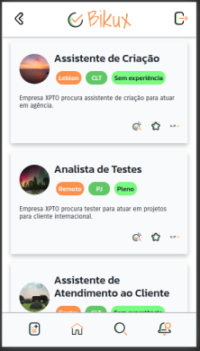

  

Nosso site de recrutamento de pessoas da comunidade, o **Bikux** ajuda moradores da periferia que desejam obter um emprego estável ao reduzir a dificuldade dessas pessoas se candidatarem, eliminar problemas de conhecimentos técnicos, e ofertar cursos para especialização, e por fim, ganhar uma vaga de emprego e alcançar a estabilidade financeira

## Nossa Stack

## Equipe de Desenvolvimento

- [Ynara Oliveira](https://github.com/ynaraoliveira)
- [Ana Araújo](https://github.com/arapujo)
- [Guilherme Cunha](https://github.com/GuilhermeSCunha)
- [Mateus Palhano](https://github.com/palhanos/)

## Equipe de Design

- [Fabi Rodrigues](https://www.linkedin.com/in/frontfabi/)
- [Iuri Veloso](https://www.linkedin.com/in/iuri-veloso-f%C3%A9lix/)

  ## Telas

  <table>
    <tr>
      <td></td>
      <td></td>
    </tr>
    <tr>
      <td></td>
      <td></td>
    </tr> 
  </table>

## Como acessar

- [Produção](https://bikux.netlify.app/)

### `yarn start`

Executa o projeto em modo de desenvolvimento.
Abre [http://localhost:3000](http://localhost:3000) para ver o projeto no navegador.

A página vai recarregar quando você salvar as alterações no código.\
Você também consegue ver os erros de código no console.

### `yarn build`

Constrói a aplicação na pasta `build`.\
